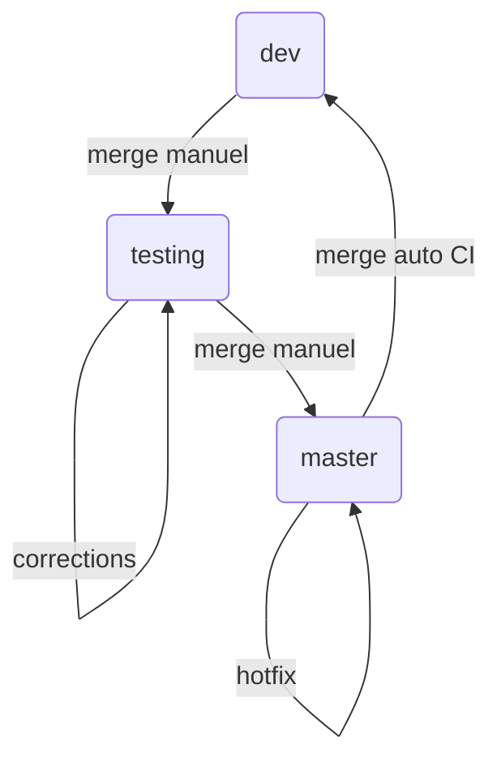

# Environement de développement

- [Dépot git](#dépot-git)
  - [Organisation des branches](#organisation-des-branches)
  - [Paramétrages git](#paramétrages-git)
  - [Nommage des commits](#nommage-des-commits)
  - [Création d'une version](#création-dune-version)
- [Éditeur de code](#éditeur-de-code)
- [Workflow Gitlab](#workflow-gitlab)
  - [Issues](#issues)
  - [Merge Requests](#merge-requests)
- [CI (Continuous Integration)](#ci-continuous-integration)

---

## Dépot git

### Organisation des branches

Il y a 3 branches permanentes dans le dépot git :

- **`master`** : branche de production
- **`testing`** : branche de pré-production
- **`dev`** : branche par défaut dans laquelle sont faits les merges

Ces branches sont en lecture seule : aucun commit n'y est autorisé directement. Il faut obligatoirement passer par une
issue gitlab et une merge request. Les autres branches peuvent être des branches temporaires liées à une Merge Request
(leur nom commence par le numéro de l'issue concernée) et seront automatiquement supprimées une fois mergées.

> TODO: Explication des branches permanentes Rizomo

### Paramétrages git

> TODO: Confirmer avec Daniel

Pull avec rebase auto ([doc git en](https://git-scm.com/docs/git-pull#Documentation/git-pull.txt--r) /
[fr](https://git-scm.com/docs/git-pull/fr#git-pull--r)) `git pull --rebase=merges origin dev`

Ou directement dans le `.gitconfig` : `git config --global pull.rebase merges`

### Nommage des commits

Le message des commits doit respecter une nomenclature (lien doc contributing).

### Création d'une version

Lorsqu'on veut sortir une nouvelle version, la branche **`dev`** est mergée dans la branche **`testing`**. Elle est
ensuite testée en profondeur et les bugs rencontrés sont corrigés directement dans cette branche. Une fois approuvée, la
branche **`testing`** est mergée dans **`master`** pour sortir la nouvelle version en production. Le CI incrémente
automatiquement le numéro de version en fonction des commits et génère un `changelog`. Les bugs rencontrés en production
sont corrigés directement dans **`master`** (hotfix), le CI merge ensuite automatiquement les modifications de
**`master`** dans **`dev`** (lien doc semantic release).



## Éditeur de code

- Éditeur conseillé : [codium](https://github.com/VSCodium/vscodium#download-install)
- Extensions conseillées :
  - ES7+ React/Redux/React-Native snippets
  - ESLint
  - Meteor
  - Meteor snippets
  - Prettier - Code formatter
- Activer la Mise en forme automatique lors de l'enregistrement (editor.formatOnSave)
- Mettre Prettier comme formateur par défaut (editor.defaultFormatter)

## Workflow Gitlab

### Issues

Tout développement doit être lié à une issue.

- Création d'une issue (problème constaté, méthode de reproduction, copie d'écran...)
- labels (+ le "CRITICAL")
- les labels de l'issue impactent aussi la MR liée
- déplacement dans le board

### Merge Requests

- Créer une MR depuis l'issue (+ cas particulier du hotfix)
- Pendant le travail sur la MR, faire régulièrement des rebases de dev (ou de la branche d'origine)
- Discussion entre les testeurs et le développeur (bugs trouvés/correction)
- Les labels vus dans la MR sont celles de l'issue liée : à chaque étape du travail, penser à déplacer l'issue dans le
  board pour refléter son état
- Au moins 2 approbations nécessaires, dont la première doit venir de l'équipe qui a ouvert la MR
- Seuls les responsables d'équipe peuvent merger (donc le travail de dev s'arrète lorsque la MR est dans l'état
  `To Merge`)

## CI (Continuous Integration)

À chaque commit poussé sur le serveur, le CI (`.gitlab-ci.yml`) se lance et vérifie :

- Formatage des messages de commit
- Lint
- Test unitaires

Il est possible de tester en local le lint et les tests unitaires avec les commandes :

```
meteor npm run lint
meteor npm test

```
